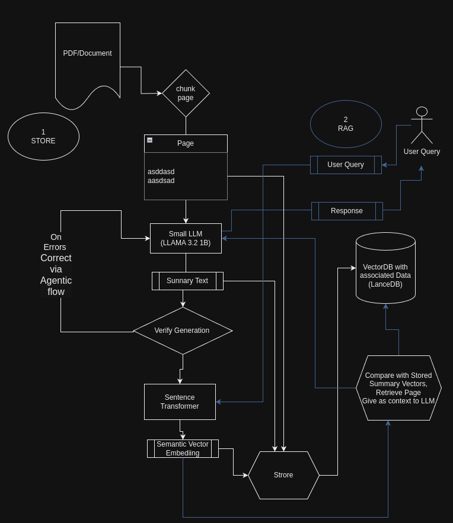

# Leveraging Smaller LLMs for Enhanced Retrieval-Augmented Generation (RAG)
## Llama-3.2–1 B-Instruct and LanceDB

Intially published [here](https://towardsdatascience.com/leveraging-smaller-llms-for-enhanced-retrieval-augmented-generation-rag-bc320e71223d): 

 Retrieval-augmented generation (RAG) combines large language models with external knowledge sources to produce more accurate and contextually relevant responses. This article explores how smaller language models (LLMs), like the recently opensourced Meta 1 Billion model, can be effectively utilized to summarize and index large documents, thereby improving the efficiency and scalability of RAG systems. We provide a step-by-step guide, complete with code snippets, on how to summarize chunks of text from a product documentation PDF and store them in a LanceDB database for efficient retrieval.

## Introduction
Retrieval-Augmented Generation is a paradigm that enhances the capabilities of language models by integrating them with external knowledge bases. While large LLMs like GPT-4 have demonstrated remarkable capabilities, they come with significant computational costs. Small LLMs offer a more resource-efficient alternative, especially for tasks like text summarization and keyword extraction, which are crucial for indexing and retrieval in RAG systems.

We will demonstrate how to use a small LLM to:

- Extract and summarize text from a PDF document.
- Generate embeddings for summaries and keywords.
- Store the data efficiently in a LanceDB database.
- Use this for effective RAG
- Also a Agentic workflow for self correcting errors from the LLM

Using a smaller LLM drastically reduces the cost for these types of conversions on huge data-sets and gets similar benefits for simpler tasks as the larger parameter LLMs and can easily be hosted in the Enterprise or from the Cloud with minimal cost.

We will use LLAMA 3.2 1 Billion parameter model, the smallest state-of-the-art LLM as of now.



LLM Enhanced RAG (Image by Author)

### The Problem with Embedding Raw Text

Before diving into the implementation, it’s essential to understand why embedding raw text from documents can be problematic in RAG systems.

#### Ineffective Context Capture
Embedding raw text from a page without summarization often leads to embeddings that are:

#### High-dimensional noise: Raw text may contain irrelevant information, formatting artefacts, or boilerplate language that doesn’t contribute to understanding the core content.

####  Diluted key concepts: Important concepts may be buried within extraneous text, making the embeddings less representative of the critical information.

####  Retrieval Inefficiency: When embeddings do not accurately represent the key concepts of the text, the retrieval system may fail to:

####  Match user queries effectively: The embeddings might not align well with the query embeddings, leading to poor retrieval of relevant documents.

####  Provide correct context: Even if a document is retrieved, it may not offer the precise information the user is seeking due to the noise in the embedding.

###  Solution: Summarization Before Embedding
Summarizing the text before generating embeddings addresses these issues by:

- Distilling Key Information: Summarization extracts the essential points and keywords, removing unnecessary details.
- Improving Embedding Quality: Embeddings generated from summaries are more focused and representative of the main content, enhancing retrieval accuracy.

#### Prerequisites

Before we begin, ensure you have the following installed:

- Python 3.7 or higher
- PyTorch
- Transformers library
- SentenceTransformers
- PyMuPDF (for PDF processing)
- LanceDB
- A laptop with GPU Min 6 GB or Colab (T4 GPU will be sufficient) or similar

### Step 1: Setting Up the Environment

First, import all the necessary libraries and set up logging for debugging and tracking.

```
import pandas as pd
import fitz  # PyMuPDF
from transformers import AutoModelForCausalLM, AutoTokenizer
import torch
import lancedb
from sentence_transformers import SentenceTransformer
import json
import pyarrow as pa
import numpy as np
import re
```

### Step 2: Defining Helper Functions

Creating the Prompt
We define a function to create prompts compatible with the LLAMA 3.2 model.

```
def create_prompt(question):
    """
    Create a prompt as per LLAMA 3.2 format.
    """
    system_message = "You are a helpful assistant for summarizing text and result in JSON format"
    prompt_template = f'''
<|begin_of_text|><|start_header_id|>system<|end_header_id|>
{system_message}<|eot_id|><|start_header_id|>user<|end_header_id|>
{question}<|eot_id|><|start_header_id|>assistant1231231222<|end_header_id|>
'''
    return prompt_template
```

### Processing the Prompt

This function processes the prompt using the model and tokenizer. We are setting the temperature to 0.1 to make the model less creative (less hallucinating)

```
def process_prompt(prompt, model, tokenizer, device, max_length=500):
    """
    Processes a prompt, generates a response, and extracts the assistant's reply.
    """
    prompt_encoded = tokenizer(prompt, truncation=True, padding=False, return_tensors="pt")
    model.eval()
    output = model.generate(
        input_ids=prompt_encoded.input_ids.to(device),
        max_new_tokens=max_length,
        attention_mask=prompt_encoded.attention_mask.to(device),
        temperature=0.1  # More deterministic
    )
    answer = tokenizer.decode(output[0], skip_special_tokens=True)
    parts = answer.split("assistant1231231222", 1)
   if len(parts) > 1:
        words_after_assistant = parts[1].strip()
        return words_after_assistant
    else:
        print("The assistant's response was not found.")
        return "NONE"
````

### Step 3: Loading the Model

We use the LLAMA 3.2 1B Instruct model for summarization. We are loading the model with bfloat16 to reduce the memory and running in NVIDIA laptop GPU (NVIDIA GeForce RTX 3060 6 GB/ Driver NVIDIA-SMI 555.58.02/Cuda compilation tools, release 12.5, V12.5.40) in a Linux OS.

Better would be to host via vLLM or better exLLamaV2

```
model_name_long = "meta-llama/Llama-3.2-1B-Instruct"
tokenizer = AutoTokenizer.from_pretrained(model_name_long)
device = torch.device("cuda" if torch.cuda.is_available() else "cpu")
log.info(f"Loading the model {model_name_long}")
bf16 = False
fp16 = True
if torch.cuda.is_available():
    major, _ = torch.cuda.get_device_capability()
    if major >= 8:
        log.info("Your GPU supports bfloat16: accelerate training with bf16=True")
        bf16 = True
        fp16 = False
# Load the model
device_map = {"": 0}  # Load on GPU 0
torch_dtype = torch.bfloat16 if bf16 else torch.float16
model = AutoModelForCausalLM.from_pretrained(
    model_name_long,
    torch_dtype=torch_dtype,
    device_map=device_map,
)
log.info(f"Model loaded with torch_dtype={torch_dtype}")
```

### Step 4: Reading and Processing the PDF Document

We extract text from each page of the PDF document.

```
file_path = './data/troubleshooting.pdf'
dict_pages = {}
# Open the PDF file
with fitz.open(file_path) as pdf_document:
    for page_number in range(pdf_document.page_count):
        page = pdf_document.load_page(page_number)
        page_text = page.get_text()
        dict_pages[page_number] = page_text
        print(f"Processed PDF page {page_number + 1}")
```

### Step 5: Setting Up LanceDB and SentenceTransformer

We initialize the SentenceTransformer model for generating embeddings and set up LanceDB for storing the data. We are using PyArrow based Schema for the LanceDB tables

Note that keywords are not used now but can be used for hybrid search, that is vector similarity search as well as text search if needed.

```
# Initialize the SentenceTransformer model
sentence_model = SentenceTransformer('all-MiniLM-L6-v2')
# Connect to LanceDB
db = lancedb.connect('./data/my_lancedb')
# Define the schema using PyArrow
schema = pa.schema([
    pa.field("page_number", pa.int64()),
    pa.field("original_content", pa.string()),
    pa.field("summary", pa.string()),
    pa.field("keywords", pa.string()),
    pa.field("vectorS", pa.list_(pa.float32(), 384)),  # Embedding size of 384
    pa.field("vectorK", pa.list_(pa.float32(), 384)),
])
# Create or connect to a table
table = db.create_table('summaries', schema=schema, mode='overwrite')
Step 6: Summarizing and Storing Data
We loop through each page, generate a summary and keywords, and store them along with embeddings in the database.

# Loop through each page in the PDF
for page_number, text in dict_pages.items():
    question = f"""For the given passage, provide a long summary about it, incorporating all the main keywords in the passage.
Format should be in JSON format like below:
{{
    "summary": <text summary>,
    "keywords": <a comma-separated list of main keywords and acronyms that appear in the passage>,
}}
Make sure that JSON fields have double quotes and use the correct closing delimiters.
Passage: {text}"""
    
    prompt = create_prompt(question)
    response = process_prompt(prompt, model, tokenizer, device)
    
    # Error handling for JSON decoding
    try:
        summary_json = json.loads(response)
    except json.decoder.JSONDecodeError as e:
        exception_msg = str(e)
        question = f"""Correct the following JSON {response} which has {exception_msg} to proper JSON format. Output only JSON."""
        log.warning(f"{exception_msg} for {response}")
        prompt = create_prompt(question)
        response = process_prompt(prompt, model, tokenizer, device)
        log.warning(f"Corrected '{response}'")
        try:
            summary_json = json.loads(response)
        except Exception as e:
            log.error(f"Failed to parse JSON: '{e}' for '{response}'")
            continue
    
    keywords = ', '.join(summary_json['keywords'])
    
    # Generate embeddings
    vectorS = sentence_model.encode(summary_json['summary'])
    vectorK = sentence_model.encode(keywords)
    
    # Store the data in LanceDB
    table.add([{
        "page_number": int(page_number),
        "original_content": text,
        "summary": summary_json['summary'],
        "keywords": keywords,
        "vectorS": vectorS,
        "vectorK": vectorK
    }])
    
    print(f"Data for page {page_number} stored successfully.")
 ```

## Using LLMs to Correct Their Outputs

When generating summaries and extracting keywords, LLMs may sometimes produce outputs that are not in the expected format, such as malformed JSON.

We can leverage the LLM itself to correct these outputs by prompting it to fix the errors. This is shown in the code above

```
# Use the Small LLAMA 3.2 1B model to create summary
for page_number, text in dict_pages.items():
    question = f"""For the given passage, provide a long summary about it, incorporating all the main keywords in the passage.
    Format should be in JSON format like below: 
    {{
        "summary": <text summary> example "Some Summary text",
        "keywords": <a comma separated list of main keywords and acronyms that appear in the passage> example ["keyword1","keyword2"],
    }}
    Make sure that JSON fields have double quotes, e.g., instead of 'summary' use "summary", and use the closing and ending delimiters.
    Passage: {text}"""
    prompt = create_prompt(question)
    response = process_prompt(prompt, model, tokenizer, device)
    try:
        summary_json = json.loads(response)
    except json.decoder.JSONDecodeError as e:
        exception_msg = str(e)
        # Use the LLM to correct its own output
        question = f"""Correct the following JSON {response} which has {exception_msg} to proper JSON format. Output only the corrected JSON.
        Format should be in JSON format like below: 
        {{
            "summary": <text summary> example "Some Summary text",
            "keywords": <a comma separated list of keywords and acronyms that appear in the passage> example ["keyword1","keyword2"],
        }}"""
        log.warning(f"{exception_msg} for {response}")
        prompt = create_prompt(question)
        response = process_prompt(prompt, model, tokenizer, device)
        log.warning(f"Corrected '{response}'")
        # Try parsing the corrected JSON
        try:
            summary_json = json.loads(response)
        except json.decoder.JSONDecodeError as e:
            log.error(f"Failed to parse corrected JSON: '{e}' for '{response}'")
            continue
```

In this code snippet, if the LLM’s initial output cannot be parsed as JSON, we prompt the LLM again to correct the JSON. This self-correction pattern improves the robustness of our pipeline.

Suppose the LLM generates the following malformed JSON:

```
{
    'summary': 'This page explains the installation steps for the product.',
    'keywords': ['installation', 'setup', 'product']
}
```

Attempting to parse this JSON results in an error due to the use of single quotes instead of double quotes. We catch this error and prompt the LLM to correct it:

```
exception_msg = "Expecting property name enclosed in double quotes"
question = f"""Correct the following JSON {response} which has {exception_msg} to proper JSON format. Output only the corrected JSON."""
The LLM then provides the corrected JSON:

{
    "summary": "This page explains the installation steps for the product.",
    "keywords": ["installation", "setup", "product"]
}
```

By using the LLM to correct its own output, we ensure that the data is in the correct format for downstream processing.

#### Extending Self-Correction via LLM Agents

This pattern of using the LLM to correct its outputs can be extended and automated through the use of LLM Agents. LLM Agents can:

- Automate Error Handling: Detect errors and autonomously decide how to correct them without explicit instructions.
- Improve Efficiency: Reduce the need for manual intervention or additional code for error correction.
- Enhance Robustness: Continuously learn from errors to improve future outputs.
L
LM Agents act as intermediaries that manage the flow of information and handle exceptions intelligently. They can be designed to:

- Parse outputs and validate formats.
- Re-prompt the LLM with refined instructions upon encountering errors.
- Log errors and corrections for future reference and model fine-tuning.

Approximate Implementation:

Instead of manually catching exceptions and re-prompting, an LLM Agent could encapsulate this logic:

```
def generate_summary_with_agent(text):
    agent = LLMAgent(model, tokenizer, device)
    question = f"""For the given passage, provide a summary and keywords in proper JSON format."""
    prompt = create_prompt(question)
    response = agent.process_and_correct(prompt)
    return response
```   

The LLMAgent class would handle the initial processing, error detection, re-prompting, and correction internally.

Now lets see how we can use the Embeddings for an effective RAG pattern again using the LLM to help in ranking.

## Retrieval and Generation: Processing the User Query

This is the usual flow. We take the user’s question and search for the most relevant summaries.

```
# Example usage
user_question = "Not able to manage new devices"
results = search_summary(user_question, sentence_model)
```

#### Preparing the Retrieved Summaries

We compile the retrieved summaries into a list, associating each summary with its page number for reference.

```
summary_list = []
for idx, result in enumerate(results):
    summary_list.append(f"{result['page_number']}# {result['summary']}")
```

#### Ranking the Summaries

We prompt the language model to rank the retrieved summaries based on their relevance to the user’s question and select the most relevant one. 

This is again using the LLM in ranking the summaries than the K-Nearest Neighbour or Cosine distance or other ranking algorithms alone for the contextual embedding (vector) match.

```
question = f"""From the given list of summaries {summary_list}, rank which summary would possibly have \
the answer to the question '{user_question}'. Return only that summary from the list."""
log.info(question)
```

#### Extracting the Selected Summary and Generating the Final Answer

We retrieve the original content associated with the selected summary and prompt the language model to generate a detailed answer to the user’s question using this context.

```
for idx, result in enumerate(results):
    if int(page_number) == result['page_number']:
        page = result['original_content']
        question = f"""Can you answer the query: '{user_question}' \
using the context below?
Context: '{page}'
"""
        log.info(question)
        prompt = create_prompt(
            question,
            "You are a helpful assistant that will go through the given query and context, think in steps, and then try to answer the query \
with the information in the context."
        )
        response = process_prompt(prompt, model, tokenizer, device, temperature=0.01)  # Less freedom to hallucinate
        log.info(response)
        print("Final Answer:")
        print(response)
        break
```

### Explanation of the Workflow

#### 1. User Query Vectorization: The user’s question is converted into an embedding using the same SentenceTransformer model used during indexing.

#### 2. Similarity Search: The query embedding is used to search the vector database (LanceDB) for the most similar summaries and return Top 3

```
>>>From the VectorDB Cosine search and Top 3 nearest neighbour search result, prepended by linked page numbers

07:04:00 INFO:From the given list of summary [[
'112# Cannot place newly discovered device in managed state', 
'113# The passage discusses the troubleshooting steps for managing newly discovered devices on the NSF platform, specifically addressing issues with device placement, configuration, and deployment.',
'116# Troubleshooting Device Configuration Backup Issue']] rank which summary would possibly have the possible answer to the question Not able to manage new devices. Return only that summary from the list
```

#### 3. Summary Ranking: 

The retrieved summaries are passed to the language model, which ranks them based on relevance to the user’s question.

```
>>>Asking LLM to Select from the Top N based on context

07:04:01 INFO:Selected Summary ''113# The passage discusses the troubleshooting steps for managing newly discovered devices on the NSF (Network Systems and Functional Requirements) platform, specifically addressing issues with device placement, configuration, and deployment.''
```

#### 4. Context Retrieval: The original content associated with the most relevant summary is retrieved by parsing out the page number and getting the associated page from the LanceDB

```
07:04:01 INFO:Page number: 113
07:04:01 INFO:Can you answer the question or query or provide more deatils query:'Not able to manage new devices'         Using the context below
        context:'3 
Check that the server and client platforms are appropriately sized. ...
Failed SNMP communication between the server and managed device.
SNMP traps from managed devices are arriving at one server, 
or no SNMP traps are ....
'
```
#### 5. Answer Generation: The language model generates a detailed answer to the user’s question using the retrieved context.

Here is a sample output from a sample PDF I have used

```
07:04:08 INFO:I'll go through the steps and provide more details to answer the query.

The query is: "Not able to manage new devices"

Here's my step-by-step analysis:

**Step 1: Check that the server and client platforms are appropriately sized**

The context mentions that the NSP Planning Guide is available, which implies that the NSP (Network Service Provider) has a planning process to ensure that the server and client platforms are sized correctly. This suggests that the NSP has a process in place to evaluate the performance and capacity of the server and client platforms to determine if they are suitable for managing new devices.

**Step 2: Check for resynchronization problems between the managed network and the NFM-P**

The context also mentions that resynchronization problems between the managed network and the NFM-P can cause issues with managing new devices. This implies that there may be a problem with the communication between the server and client platforms, which can prevent new devices from being successfully managed.

**Step 3: Check for failed SNMP communication between the server and managed device**

The context specifically mentions that failed SNMP communication between the server and managed device can cause issues with managing new devices. This suggests that there may be a problem with the communication between the server and the managed device, which can prevent new devices from being successfully managed.

**Step 4: Check for failed deployment of the configuration request**

The context also mentions that failed deployment of the configuration request can cause issues with managing new devices. This implies that there may be a problem with the deployment process, which can prevent new devices from being successfully managed.

**Step 5: Perform the following steps**

The context instructs the user to perform the following steps:

1. Choose Administration→NE Maintenance→Deployment from the XXX main menu.
2. The Deployment form opens, listing incomplete deployments, deployer, tag, state, and other information.

Based on the context, it appears that the user needs to review the deployment history to identify any issues that may be preventing the deployment of new devices.

**Answer**

Based on the analysis, the user needs to:

1. Check that the server and client platforms are appropriately sized.
2. Check for resynchronization problems between the managed network and the NFM-P.
3. Check for failed SNMP communication between the server and managed device.
4. Check for failed deployment of the configuration request.

By following these steps, the user should be able to identify and resolve the issues preventing the management of
```

### Conclusion

We can efficiently summarise and extract keywords from large documents using a small LLM like LLAMA 3.2 1B Instruct. These summaries and keywords can be embedded and stored in a database like LanceDB, enabling efficient retrieval for RAG systems using the LLM in the workflow and not just in generation

## References

- Meta LLAMA 3.2 1B Instruct Model
- SentenceTransformers
- LanceDB
- PyMuPDF Documentation